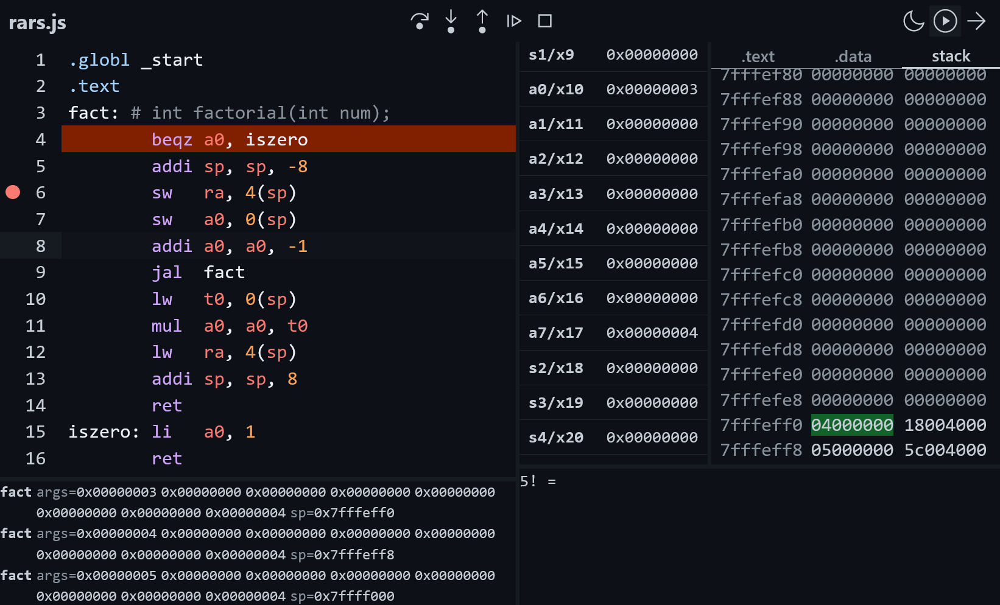

# rars.js
A minimal assembler, editor, simulator and debugger for RISC-V (RV32IM), meant to be a useful tool for computer architecture students, inspired by the original [RARS](https://github.com/TheThirdOne/rars).
You can try it now online on [rarsjs.vercel.app](https://rarsjs.vercel.app).


## Features
This initial release introduces the following core features:
### Web UI version:
- **modern editing experience**:
  - whole-UI light and dark themes
  - CodeMirror 6-based editor with RV32IM syntax highighting
  - live error reporting
- **debugging tools**:
  - register and memory visualization with live updates
  - call stack inspector
  - breakpoint management
  - step/next/continue debugging

### Command-line utilities
- minimal, cross-platform C
- ELF binary and object file generation
- headless execution of the emulator

# Installation
## Command-line utilities
> [!NOTE]
The CLI version relies on ezld, so make sure you cloned recursively, or alternatively do `git submodule update --init --recursive`

A working C compiler and 
```
make
```

## Web UI
Clang with support for WASM (if you're using macOS, make sure you're not using AppleClang), node and npm
```
npm install
npm run dev # for a developement live reload server
npm run build # to build in dist/
```